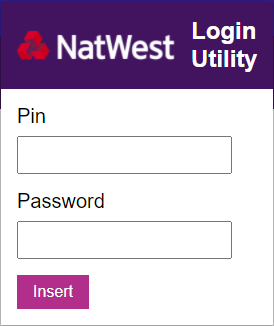

# NatWest Chrome Extension


## About this Project

A Chrome Extension that runs on NatWest login pages. When you press the extension button, a popup appears that allows you to input your PIN and password. When you then press insert, the correct characters are inserted into the boxes on the page.



### Built with

- Chrome Extensions
- Webpack
- Babel

## Getting Started

### Prerequisites

- Node

### Installation

1. Install the dependencies.

```
npm i
```

2. Run the build tool.

```
npm run dev
```

3. Run through deployment (local)

4. Press the refresh button on the extension in Chrome after every change.

## Deployment

1. Open Chrome to "chrome://extensions/".

2. Enable developer mode in the top right.

3. Click "load unpacked" in the top left.

4. Select the dist folder in this repo.

## Usage

1. Go to the NatWest login page where it asks you for specific characters of your PIN and password.

2. Press the extension icon in the top left.

3. Input your PIN and password and press 'insert'.

The popup will close and the characters will be inserted.

## Roadmap

- [ ] Tidy up webpack config to be able to use Vue

## Release History

- v0.1.0
  - Initial design
